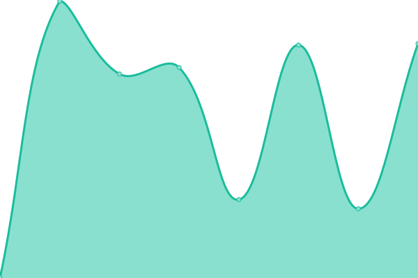

# [📈 Live Status](https://status.diff.network): <!--live status--> **🟩 All systems operational**

This repository contains the open-source uptime monitor and status page for [Diff Network](https://diff.network), powered by [Upptime](https://github.com/upptime/upptime).

With [Upptime](https://upptime.js.org), you can get your own unlimited and free uptime monitor and status page, powered entirely by a GitHub repository. We use [Issues](https://github.com/Diff-Network/network-status/issues) as incident reports, [Actions](https://github.com/Diff-Network/network-status/actions) as uptime monitors, and [Pages](https://status.diff.network) for the status page.

<!--start: status pages-->
<!-- This summary is generated by Upptime (https://github.com/upptime/upptime) -->
<!-- Do not edit this manually, your changes will be overwritten -->
<!-- prettier-ignore -->
| URL | Status | History | Response Time | Uptime |
| --- | ------ | ------- | ------------- | ------ |
|  [Web Interface](https://diff.network/about) | 🟩 Up | [web-interface.yml](https://github.com/Diff-Network/network-status/commits/HEAD/history/web-interface.yml) | 

 1394ms
     
 | 

<a href="https://status.diff.network/history/web-interface">100.00%</a>
    

|  [API Service](https://diff.network/api/v1/instance) | 🟩 Up | [api-service.yml](https://github.com/Diff-Network/network-status/commits/HEAD/history/api-service.yml) | 

 578ms
     
 | 

<a href="https://status.diff.network/history/api-service">100.00%</a>
    

|  [Streaming API](https://diff.network/api/v1/streaming/health) | 🟩 Up | [streaming-api.yml](https://github.com/Diff-Network/network-status/commits/HEAD/history/streaming-api.yml) | 

 234ms
     
 | 

<a href="https://status.diff.network/history/streaming-api">100.00%</a>
    

|  [Media Storage](https://entity.diff.network/status_check.png) | 🟩 Up | [media-storage.yml](https://github.com/Diff-Network/network-status/commits/HEAD/history/media-storage.yml) | 

 235ms
     
 | 

<a href="https://status.diff.network/history/media-storage">100.00%</a>
    

<!--end: status pages-->

[**Visit our status website →**](https://status.diff.network)

## 📄 License

- Powered by: [Upptime](https://github.com/upptime/upptime)
- Code: [MIT](./LICENSE) © [Anand Chowdhary](https://anandchowdhary.com), supported by [Pabio](https://pabio.com)
- Data in the `./history` directory: [Open Database License](https://opendatacommons.org/licenses/odbl/1-0/)
